# WAVELET LATENT DIFFUSION (WALA)
[](https://arxiv.org/pdf/2411.08017) [](https://colab.research.google.com/drive/1W5zPXw9xWNpLTlU5rnq7g3jtIA2BX6aC?usp=sharing)

[](https://huggingface.co/models?search=ADSKAILab/WaLa)

This is the official codebase for the paper "**WAVELET LATENT DIFFUSION (WALA): BILLION-
PARAMETER 3D GENERATIVE MODEL WITH COM-PACT WAVELET ENCODINGS**"

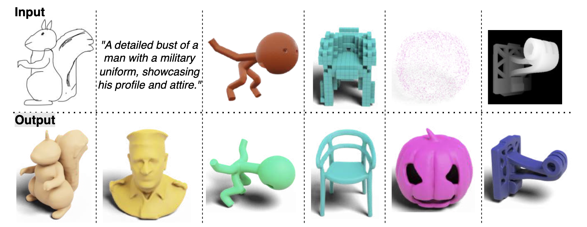

### [Project Page](https://autodeskailab.github.io/WaLaProject), [arxiv paper](https://arxiv.org/abs/2411.08017), [Models](https://huggingface.co/models?search=ADSKAILab/WaLa), [Demo](https://colab.research.google.com/drive/1W5zPXw9xWNpLTlU5rnq7g3jtIA2BX6aC?usp=sharing)

### Tasks
- [x] Single-view to 3D inference code
- [x] Sketch to 3D inference code
- [x] Multi-view to 3D inference code
- [x] Multi-view-depth 4 to 3D inference code
- [x] Multi-view-depth 6 to 3D inference code
- [x] 16³ resolution Voxel to 3D inference code
- [x] Point cloud to 3D inference code
- [x] Text to Multi-view infrence code and model weights
- [x] Text to Multi-depthmap infrence code and model weights
- [x] Google Colab demo
- [ ] Unconditional 3D generation inference code
- [ ] 1.4B models 


## Getting Started

### Installation
- Python >= 3.10
- Install CUDA if available
- Install PyTorch according to your platform: [https://pytorch.org/get-started/locally/](https://pytorch.org/get-started/locally/)
- Install other dependencies by `pip install -r requirements.txt`

For example, on AWS EC2 instances with PyTorch Deep learning AMI, you can setup the environment as follows:
```
conda create -n wala python==3.10
conda activate wala
pip install -r requirements.txt
```

### Inference

For multiple generation use different --seed parameter

### Optimal Parameters for `--scale` and `--diffusion_rescale_timestep`

Based on our extensive grid search on the validation set across different conditions, the optimal parameters are shown below.

| Model              | Scale | Timestep |
|--------------------|-------|----------|
| Voxel              | 1.5   | 5        |
| Pointcloud         | 1.3   | 8        |
| Single-View RGB    | 1.8   | 5        |
| Sketch             | 1.8   | 5        |
| Single-View Depth  | 1.8   | 5        |
| Multi-View RGB     | 1.3   | 5        |
| Multi-View Depth   | 1.3   | 5        |
| 6 Multi-View Depth | 1.5   | 10       |
| Text to 3d         | 1.5   | 10       |
| Unconditional      | -     | 1000     |

*Table: Classifier-free scale and timestep used in the paper*

### Single-View to 3D

<div align="center">
  <!-- Row 1: Images -->
  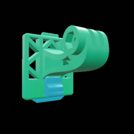
  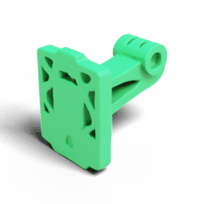
  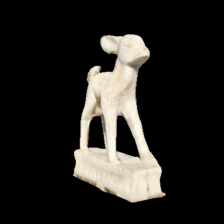
  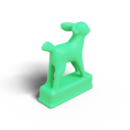
  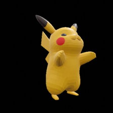
  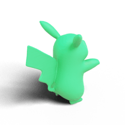
</div>

[](https://huggingface.co/ADSKAILab/WaLa-SV-1B)

The input data for this method is a single-view image of a 3D object.

```sh
python run.py --model_name ADSKAILab/WaLa-SV-1B --images examples/single_view/table.png --output_dir examples --output_format obj --scale 1.8 --diffusion_rescale_timestep 5

```

### Sketch to 3D

<div align="center">
  <!-- Row 1: Images -->
  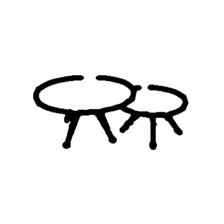
  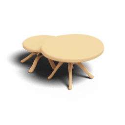
  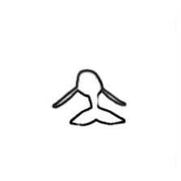
  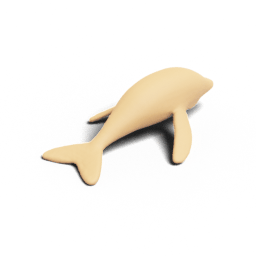
  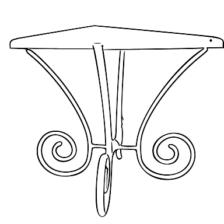
  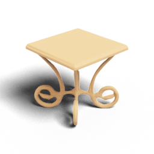
</div>


[](https://huggingface.co/ADSKAILab/WaLa-SK-1B)

The model uses sketch input with detailed geometry and complex structures to generate 3D object.

```sh
python run.py --model_name ADSKAILab/WaLa-SK-1B --sketch examples/sketch/tree.png --output_dir examples --output_format obj --scale 1.8 --diffusion_rescale_timestep 5

```

### Voxel to 3D (16³ Resolution )

<div align="center">
  <!-- Row 1: Images -->
  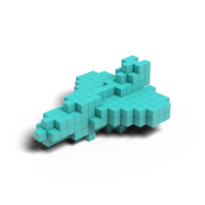
  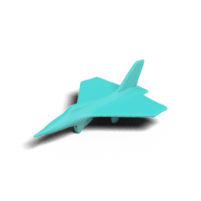
  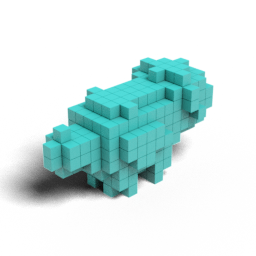
  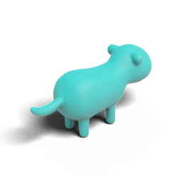
  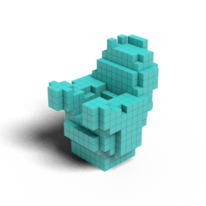
  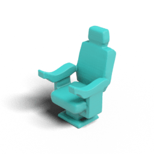
</div>

[](https://huggingface.co/ADSKAILab/WaLa-VX16-1B)

This model uses a voxelized representation of the object with a resolution of 16³. The voxel file is a JSON containing the following keys: `resolution`, `occupancy`, and `color`

```sh
python run.py --model_name ADSKAILab/WaLa-VX16-1B --voxel_files examples/voxel/horse_16.json --output_dir examples --output_format obj --scale 1.5 --diffusion_rescale_timestep 5

```

### Pointcloud to 3D

<div align="center">
  <!-- Row 1: Images -->
  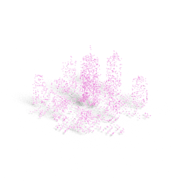
  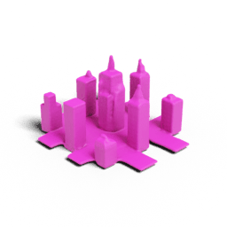
  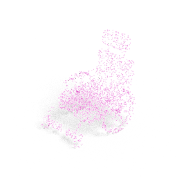
  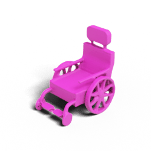
  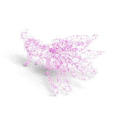
  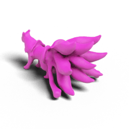
</div>

[](https://huggingface.co/ADSKAILab/WaLa-PC-1B)

The input data for this method is a pointcloud of a 3D object.

```sh
python run.py --model_name ADSKAILab/WaLa-PC-1B --pointcloud examples/pointcloud/ring.h5df --output_dir examples --output_format obj --scale 1.3 --diffusion_rescale_timestep 8
```

### Single Depth-Map to 3D

<div align="center">
  <!-- Row 1: Images -->
  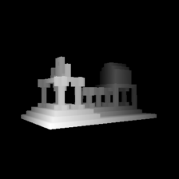
  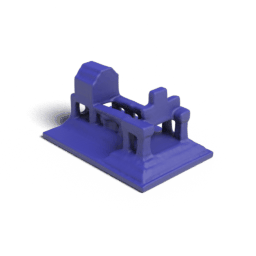
  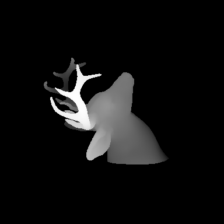
  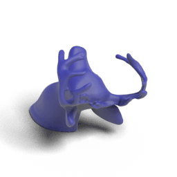
  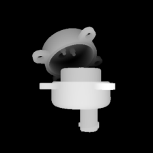
  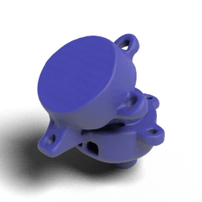
</div>

[](https://huggingface.co/ADSKAILab/WaLa-DM1-1B)

The model uses single depth-map image to generate 3D object.

```sh
python run.py --model_name ADSKAILab/WaLa-DM1-1B --dm1 examples/single_depth_map/49.png --output_dir examples --output_format obj --scale 1.5 --diffusion_rescale_timestep 5

```

### Text to 3D

| "An owl" | "A monkey" | "An octopus" |
|:-------:|:----------:|:------------:|
| 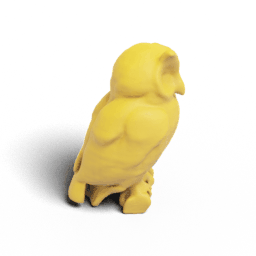 | 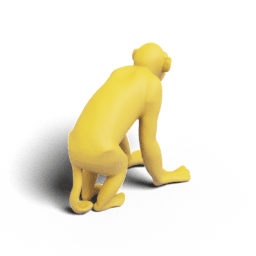 | 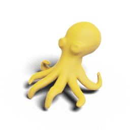 |

```sh
python run.py --model_name ADSKAILab/WaLa-MVDream-DM6 --text_to_dm6 "generate me a cup" --output_dir examples/text/

mv examples/text/depth_maps/image_0.png examples/text/depth_maps/3.png; \
mv examples/text/depth_maps/image_1.png examples/text/depth_maps/6.png; \
mv examples/text/depth_maps/image_2.png examples/text/depth_maps/10.png; \
mv examples/text/depth_maps/image_3.png examples/text/depth_maps/26.png; \
mv examples/text/depth_maps/image_4.png examples/text/depth_maps/49.png; \
mv examples/text/depth_maps/image_5.png examples/text/depth_maps/50.png

python run.py --model_name ADSKAILab/WaLa-DM6-1B --dm6 examples/text/depth_maps/3.png examples/text/depth_maps/6.png examples/text/depth_maps/10.png examples/text/depth_maps/26.png examples/text/depth_maps/49.png examples/text/depth_maps/50.png --output_dir examples/text/ --output_format obj --output_format obj --scale 1.5 --diffusion_rescale_timestep 10

```


## More Conditions !!!

### Text to Depth-Maps
[](https://huggingface.co/ADSKAILab/WaLa-MVDream-DM6)
The text input is used to generate six-view depth maps to support text-to-3D generation

```sh
python run.py --model_name ADSKAILab/WaLa-MVDream-DM6 --text_to_dm6 "generate me a cup" --output_dir examples

```

### Text to Multi-View
[](https://huggingface.co/ADSKAILab/WaLa-MVDream-RGB4)
The text input is used to generate four-view RGB images to support text-to-3D generation

```sh
python run.py --model_name ADSKAILab/WaLa-MVDream-RGB4 --text_to_mv "generate me a cup" --output_dir examples

```

### Multi-View to 3D
[](https://huggingface.co/ADSKAILab/WaLa-RGB4-1B)

For multi-view input, the model utilizes multiple images of the same object captured from different camera angles. These images should be named according to the index of the camera view parameters as described in [Data Formats](#data-formats)

```sh
python run.py --model_name ADSKAILab/WaLa-RGB4-1B --multi_view_images examples/multi_view/003.png examples/multi_view/006.png examples/multi_view/010.png examples/multi_view/026.png --output_dir examples --output_format obj --scale 1.3 --diffusion_rescale_timestep 5

```

### 4-View Depth-Maps to 3D
[](https://huggingface.co/ADSKAILab/WaLa-DM4-1B)

For depth-maps input, the model utilizes 4 depth-map images of the same object captured from different camera angles to create 3D object.

```sh
python run.py --model_name ADSKAILab/WaLa-DM4-1B --dm4 examples/depth_maps_4/3.png examples/depth_maps_4/6.png examples/depth_maps_4/10.png examples/depth_maps_4/26.png --output_dir examples --output_format obj --scale 1.3 --diffusion_rescale_timestep 5

```

### 6-View Depth-Maps to 3D
[](https://huggingface.co/ADSKAILab/WaLa-DM6-1B)

For depth-maps input, the model utilizes 6 depth-map images of the same object captured from different camera angles to create 3D object.

```sh
python run.py --model_name ADSKAILab/WaLa-DM6-1B --dm6 examples/depth_maps_6/3.png examples/depth_maps_6/6.png examples/depth_maps_6/10.png examples/depth_maps_6/26.png examples/depth_maps_6/49.png examples/depth_maps_6/50.png --output_dir examples --output_format obj --scale 1.5 --diffusion_rescale_timestep 10

```


### Data Formats

- **Single-View Input:** A single image file (e.g., `.png`, `.jpg`) depicting the 3D object.
- **Multi-View Input:** A set of image files taken from different camera angles. The filenames correspond to specific camera parameters. Below is a table that maps the index of each image to its corresponding camera rotation and elevation:

  | **Index** | **Rotation (degrees)** | **Elevation (degrees)** |
  |-----------|------------------------|-------------------------|
  | 0         | 57.37                  | 13.48                   |
  | 1         | 36.86                  | 6.18                    |
  | 2         | 11.25                  | 21.62                   |
  | 3         | 57.27                  | 25.34                   |
  | 4         | 100.07                 | 9.10                    |
  | 5         | 116.91                 | 21.32                   |
  | 6         | 140.94                 | 12.92                   |
  | 7         | 99.88                  | 3.57                    |
  | 8         | 5.06                   | 11.38                   |
  | 9         | 217.88                 | 6.72                    |
  | 10        | 230.76                 | 13.27                   |
  | 11        | 180.99                 | 23.99                   |
  | 12        | 100.59                 | -6.37                   |
  | 13        | 65.29                  | -2.70                   |
  | 14        | 145.70                 | 6.61                    |
  | 15        | 271.98                 | 0.15                    |
  | 16        | 284.36                 | 5.84                    |
  | 17        | 220.28                 | 0.07                    |
  | 18        | 145.86                 | -1.18                   |
  | 19        | 59.08                  | -13.59                  |
  | 20        | 7.35                   | 0.51                    |
  | 21        | 7.06                   | -7.82                   |
  | 22        | 146.05                 | -15.43                  |
  | 23        | 182.55                 | -5.17                   |
  | 24        | 341.95                 | 3.29                    |
  | 25        | 353.64                 | 9.75                    |
  | 26        | 319.81                 | 16.44                   |
  | 27        | 233.76                 | -8.56                   |
  | 28        | 334.96                 | -2.65                   |
  | 29        | 207.67                 | -16.79                  |
  | 30        | 79.72                  | -21.20                  |
  | 31        | 169.69                 | -26.77                  |
  | 32        | 237.16                 | -27.06                  |
  | 33        | 231.72                 | 25.91                   |
  | 34        | 284.84                 | 23.44                   |
  | 35        | 311.22                 | -14.09                  |
  | 36        | 285.15                 | -7.42                   |
  | 37        | 257.11                 | -14.38                  |
  | 38        | 319.14                 | -23.75                  |
  | 39        | 355.62                 | -9.06                   |
  | 40        | 0.00                   | 60.00                   |
  | 41        | 40.00                  | 60.00                   |
  | 42        | 80.00                  | 60.00                   |
  | 43        | 120.00                 | 60.00                   |
  | 44        | 160.00                 | 60.00                   |
  | 45        | 200.00                 | 60.00                   |
  | 46        | 240.00                 | 60.00                   |
  | 47        | 280.00                 | 60.00                   |
  | 48        | 320.00                 | 60.00                   |
  | 49        | 360.00                 | 60.00                   |
  | 50        | 0.00                   | -60.00                  |
  | 51        | 90.00                  | -60.00                  |
  | 52        | 180.00                 | -60.00                  |
  | 53        | 270.00                 | -60.00                  |
  | 54        | 360.00                 | -60.00                  |

- **Voxel Input:** A JSON file containing a voxelized representation of the object. The JSON includes:
  - **resolution:** The grid size of the voxel space (e.g., 16 or 32).
  - **occupancy:** The indices of occupied voxels.
  - **color:** The RGB values for each occupied voxel. 


### Google Colab Demo

To quickly try out the WaLa models without setting up your local environment, check out the [Google Colab Demo](https://colab.research.google.com/drive/1XIoeanLjXIDdLow6qxY7cAZ6YZpqY40d?usp=sharing).


## Citation
```bibtex
@misc{sanghi2024waveletlatentdiffusionwala,
      title={Wavelet Latent Diffusion (Wala): Billion-Parameter 3D Generative Model with Compact Wavelet Encodings}, 
      author={Aditya Sanghi and Aliasghar Khani and Pradyumna Reddy and Arianna Rampini and Derek Cheung and Kamal Rahimi Malekshan and Kanika Madan and Hooman Shayani},
      year={2024},
      eprint={2411.08017},
      archivePrefix={arXiv},
      primaryClass={cs.CV},
      url={https://arxiv.org/abs/2411.08017}
}

